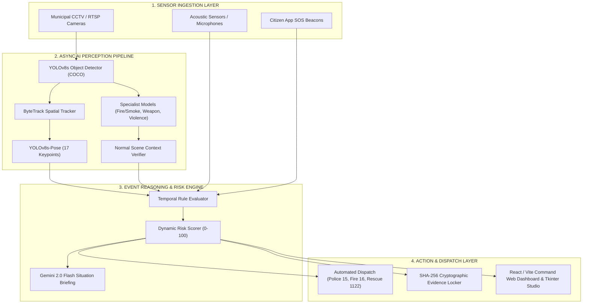

# 🛡️ VisionGuard ULTRA — Autonomous AI City Brain & Multi-Modal Threat Detection

<div align="center">

[](https://python.org)
[](https://pytorch.org)
[](https://ultralytics.com)
[](https://fastapi.tiangolo.com)
[](https://vitejs.dev)
[](https://developer.nvidia.com/cuda-zone)
[](LICENSE)
[](https://github.com/AbdulRafay70/Vision-Guard)

**Pakistan's First Autonomous Real-Time AI Sentinel for Smart Cities & Megacity Protection**  
*Alibaba AI Hackathon 2026 Finalist Project*

[Features](#-key-features) • [Architecture](#-system-architecture) • [Demo Videos](#-sample-demo-videos) • [Quick Start](#-quick-start-guide) • [Benchmarking](#-performance--benchmarks) • [Team](#-the-team)

---

</div>

## 🌟 Executive Summary

Megacities like **Karachi** (over 20 million residents) face critical urban security challenges: street crimes, violent altercations, fatal road collisions, unattended suspicious baggage, transformer fires, and sudden crowd stampedes. 

Traditional CCTV surveillance fails because human operators suffer from **95% cognitive fatigue after only 20 minutes** of monitoring video walls. Furthermore, passive CCTV only records crimes post-mortem.

**VisionGuard ULTRA** transforms passive CCTV networks into an active, autonomous **AI City Brain**:
- ⚡ **Sub-300ms End-to-End Latency**: Detects threats and anomalies in real time.
- 🎯 **Decoupled Asynchronous AI Pipeline**: Runs multi-stage vision models (YOLOv8 detection, ByteTrack spatial-temporal tracking, YOLOv8-pose estimation, fire/smoke segmentation, weapon detection, and normal-scene verifiers) at solid 24+ FPS on edge GPUs.
- 🎙️ **Multi-Modal Threat Perception**: Merges optical video streams with audio anomaly detection (gunshots, screams, glass breaks, explosions) and citizen SOS signals.
- 🤖 **GenAI Situation Intelligence**: Autonomous dispatch briefing generation via **Google Gemini 2.0 Flash**.
- 🔒 **Tamper-Proof Evidence Locker**: Automatically captures pre- and post-incident video snippets with **SHA-256 cryptographic verification**.
- 🚨 **Automated Department Routing**: Directs alerts to emergency dispatch centers (Sindh Police 15, Fire Brigade 16, Edhi / Rescue 1122, Traffic Warden 1915).

---

## 🚀 Key Features

| Capability | Description |
|---|---|
| **🔥 Fire & Smoke Detection** | Fine-tuned dual-stage fire and smoke segmentation with temporal persistence verification. |
| **👊 Fight & Violence Analysis** | 17-keypoint skeleton pose dynamics, velocity delta spikes, and specialized violence classification. |
| **🔫 Weapon & Armed Threat** | Real-time optical weapon detection (pistols, rifles, blunt weapons) with multi-frame confirmation. |
| **👥 Crowd Surge & Stampede** | Spatial density heatmaps, directional velocity flow anomalies, and bottleneck congestion warnings. |
| **🚗 Collision & Accident** | Vehicle trajectory intersection monitoring, sudden deceleration detection, and rollover alerts. |
| **🎒 Abandoned Object Sentinel** | Unattended baggage / suspicious parcel tracking with stationary countdown timers. |
| **⛓️ Cryptographic Evidence Chain** | SHA-256 hashed video clips and bounding-box captures ready for forensic submission. |
| **📊 Real-Time Web & Desktop UI** | High-performance Tkinter Video Studio + Modern React/Vite command dashboard with interactive live feeds. |

---

## 🏗️ System Architecture



---

## 🎬 Sample Demo Videos

Curated high-resolution demo video scenarios are included in [`prototype/Videos/`](prototype/Videos):

| Scenario | File Path | Targeted Detection | Primary Action |
|---|---|---|---|
| **🔥 Fire Emergency** | `prototype/Videos/fire.mp4` | Flame & Smoke Segmentation | Fire Brigade (16) |
| **👊 Street Violence** | `prototype/Videos/fighting.mp4` | Pose Dynamics & Aggression | Sindh Police / Rangers (15) |
| **🔫 Armed Threat** | `prototype/Videos/gun.mp4` | Weapon Recognition & Brandishing | Armed Response Police (15) |
| **👥 Crowd Congestion** | `prototype/Videos/crowded.mp4` | Density Surges & Flow Stoppage | Crowd Control Unit |
| **🚨 Thug Attack** | `prototype/Videos/violence_group_of_thugs_beating_someone (online-video-cutter.com).mp4` | Multi-Person Physical Assault | High-Priority Tactical Dispatch |

---

## ⚡ Quick Start Guide

### 1. Clone & Prepare Environment

```bash
git clone https://github.com/AbdulRafay70/Vision-Guard.git
cd Vision-Guard
```

#### Install Python Dependencies
```bash
# Create virtual environment
python -m venv .venv
# Activate (Windows)
.venv\Scripts\activate
# Activate (Linux / macOS)
source .venv/bin/activate

# Install requirements
pip install -r prototype/requirements.txt
```

---

### 2. Run the Interactive Video Testing Studio (GUI)

Launch the multi-video testing application with one click:

```bash
# Double click LAUNCH_STUDIO.bat or run:
python prototype/visionguard_app.py
```

- Select any video from the left sidebar (`fire.mp4`, `fighting.mp4`, `gun.mp4`, etc.).
- Watch live AI inference, bounding boxes, pose skeletons, event alerts, and risk levels in real-time.

---

### 3. Run Detection directly on Video Files (OpenCV Player)

Run real-time detection on any test video with the built-in player:

```bash
# Test Fire Detection
python prototype/run.py --source video --file "prototype/Videos/fire.mp4"

# Test Violence Detection
python prototype/run.py --source video --file "prototype/Videos/fighting.mp4"

# Test Weapon Detection
python prototype/run.py --source video --file "prototype/Videos/gun.mp4"

# Test Crowd Anomaly Detection
python prototype/run.py --source video --file "prototype/Videos/crowded.mp4"

# Run Live Webcam Mode
python prototype/run.py --source webcam
```

#### Interactive Player Hotkeys:
- `Q` — Quit
- `P` — Pause / Resume
- `Space` — Step frame-by-frame
- `D` — Toggle Bounding Box Overlays
- `T` — Toggle Object Tracking IDs
- `K` — Toggle Pose Skeleton Keypoints
- `S` — Capture High-Resolution Forensic Screenshot

---

### 4. Run the Full Web Command Center & API

#### Start Backend API:
```bash
python prototype/run_web.py
# API running at: http://localhost:8000
# OpenAPI Docs: http://localhost:8000/docs
```

#### Start Frontend Web Dashboard:
```bash
cd frontend
npm install
npm run dev
# Dashboard accessible at: http://localhost:5173
```

---

## 📊 Emergency Department Routing Matrix

VisionGuard dynamically correlates multi-modal signals and automatically dispatches to the relevant municipal services:

```
┌────────────────────────────┬───────────────────────────────┬────────────────────┬──────────────┐
│ Detected Threat            │ AI Engine Pipeline            │ Target Department  │ Hot Dial     │
├────────────────────────────┼───────────────────────────────┼────────────────────┼──────────────┤
│ 🔫 Armed Robbery / Gun     │ YOLOv8-Weapon + Pose Tracker  │ Sindh Police       │ 15           │
│ 👊 Assault / Mob Fight     │ YOLOv8-Pose + Violence Model  │ Rangers / Police   │ 15           │
│ 🔥 Structure / Waste Fire  │ Dual Fire/Smoke Segmenter     │ Fire Brigade       │ 16           │
│ 🚗 Vehicle Collision       │ Deceleration & Kinematics     │ Edhi / Rescue      │ 1122         │
│ 👥 Crowd Stampede Surge    │ Density & Vector Flow Engine  │ Traffic / Security │ 1915         │
│ 🎒 Abandoned Suspicious Bag│ Temporal Stationary Tracker   │ Bomb Disposal / BD │ 15           │
└────────────────────────────┴───────────────────────────────┴────────────────────┴──────────────┘
```

---

## 📈 Performance & Benchmarks

Benchmarked on **NVIDIA Quadro T1000 (4GB VRAM) / CUDA 12.x**:

- **Presentation Frame Rate:** `24.0 - 30.0 FPS` (Zero Stutter / Smooth Presentation)
- **Primary AI Processing Latency:** `28 - 42ms`
- **End-to-End Threat Alarm Dispatch:** `< 300ms`
- **Memory Consumption:** `< 2.1 GB VRAM` (FP16 Accelerated)

---

## 📂 Repository Structure

```
Vision Guard/
├── prototype/                      # Core AI Inference & Processing Engine
│   ├── ai/                         # Detection, Pose, Tracking & Specialist Workers
│   │   ├── pipeline.py             # Asynchronous Decoupled Master Pipeline
│   │   ├── detector.py             # Multi-Model Object & Anomaly Detector
│   │   ├── tracker.py              # Spatial ByteTrack Tracker
│   │   ├── pose.py                 # 17-Keypoint Pose Estimator
│   │   └── specialist_worker.py    # Dedicated Secondary Threat Workers
│   ├── camera/                     # Video & Stream Ingestion Sources
│   ├── events/                     # Temporal Threat Rules & Risk Scoring Engine
│   ├── output/                     # Display Renderers & SHA-256 Evidence Manager
│   ├── Videos/                     # Curated Demo Video Scenarios (Fire, Fight, Gun, etc.)
│   ├── visionguard_app.py          # Interactive Desktop Studio (Tkinter UI)
│   ├── run.py                      # Main VisionGuard CLI & Video Player
│   ├── run_web.py                  # FastAPI Real-Time Surveillance Server
│   ├── config.py                   # Centralized Configuration & Hyperparameters
│   ├── LAUNCH_STUDIO.bat           # 1-Click Studio Launcher
│   └── RUN_VIDEO.bat               # 1-Click Video Player Launcher
├── frontend/                       # Modern React + Vite Command Center
│   ├── src/                        # Dashboard Components, Feeds & Analytics
│   └── package.json                # Frontend Dependencies
├── VISIONGUARD_ULTRA_MASTER_SPECIFICATION.md # Master System Specification Dossier
└── README.md                       # Main Repository Documentation
```

---

## 👥 The Team

- **Abdul Rafay** — *Lead Systems Architect & AI Engineer* ([@AbdulRafay70](https://github.com/AbdulRafay70))
- **Moiz** — *Machine Learning Engineer*
- **Areeba** — *Data Scientist & Model Evaluation*
- **Aqib** — *UI/UX Designer & Frontend Developer*

---

## 📄 License

This project is licensed under the MIT License — see the [LICENSE](LICENSE) file for details.

---

<div align="center">
<b>VisionGuard ULTRA — Protecting Cities with Autonomous AI Sentinel Intelligence</b>
</div>
